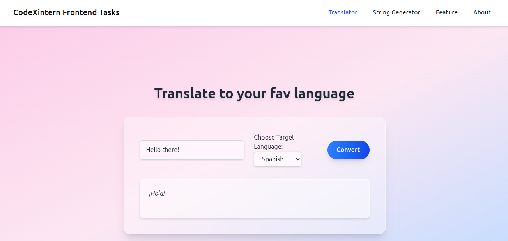
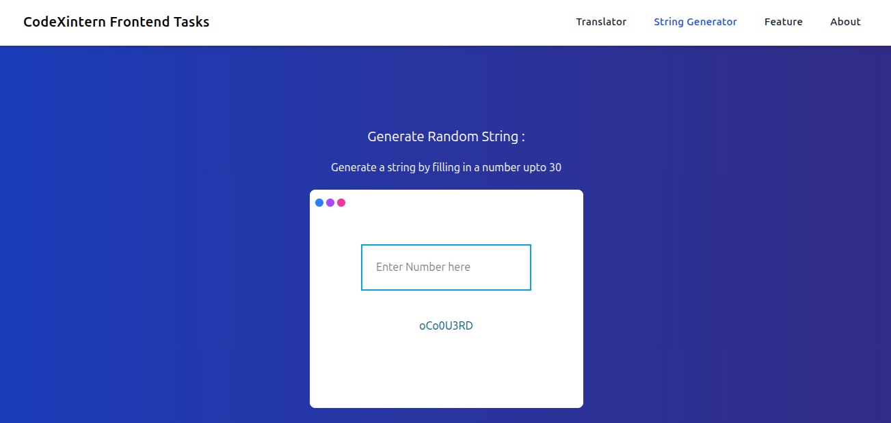
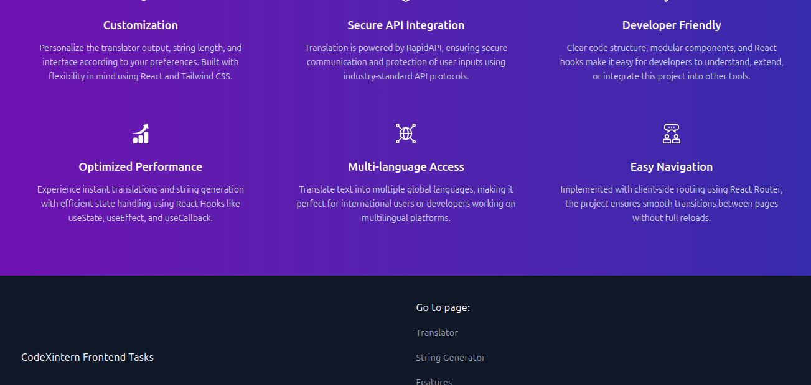

# Frontend-CodeXintern

This repository contains my submissions for the **Frontend Internship Tasks** provided by Codexintern. It features three hands-on assignments built with React, Tailwind CSS, and React Router, demonstrating core frontend development concepts and skills. [Live](https://pikupika.github.io/Frontend-Codexintern/#/)

## 🚩 About the Project

This project is a collection of interactive React apps that highlight my understanding of modern frontend tools and workflows.

---

### 🔤 1. Text Translator App

A React-based application that allows users to translate English text into their favorite languages using the RapidAPI translation service. The UI is styled with Tailwind CSS for a clean and responsive experience.

---

### 🔁 2. Random String Generator

A small utility app to generate random strings using React. This project leverages React Hooks (`useState` and `useEffect`) to handle state management and efficient re-renders.

---

### 🌐 3. Client-Side Routing

The entire application uses client-side routing with `react-router-dom` to manage different pages like **Home**, **Features**, **textgen**, and **About**. This demonstrates the ability to build a single-page application (SPA) with smooth, dynamic navigation.

---

## 🚀 Technologies Used

- **React.js**
- **Tailwind CSS**
- **React Router DOM**
- **RapidAPI** (for translation)
- **JavaScript**

---

## 📚 What I Learned

This internship project helped me strengthen my understanding of:
- Component-based architecture in React
- Building responsive and modern UIs with Tailwind CSS
- Implementing client-side routing for SPAs
- Consuming APIs and managing asynchronous data in React
- Using React Hooks for state and effect management

---

## 📸 Screenshots

<!-- Replace with actual screenshots -->




---

## 🏁 Getting Started

1. Clone this repository:
    ```bash
    git clone https://github.com/your-username/Frontend-CodeXintern.git
    cd Frontend-CodeXintern
    ```
2. Install dependencies:
    ```bash
    npm install
    ```
3. Run the app locally:
    ```bash
    npm start
    ```
4. Open [http://localhost:3000](http://localhost:3000) to view it in your browser.

---

## 🤝 Contributing

Have suggestions or want to contribute? Feel free to open an issue or a pull request!

---

> **Built with dedication as part of my frontend learning journey with Codexintern.**
